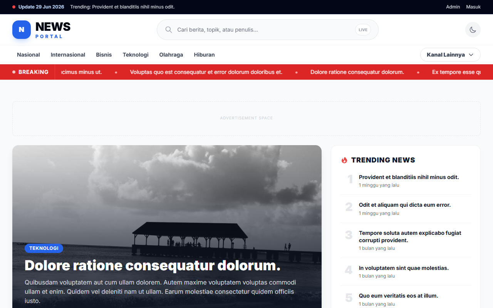
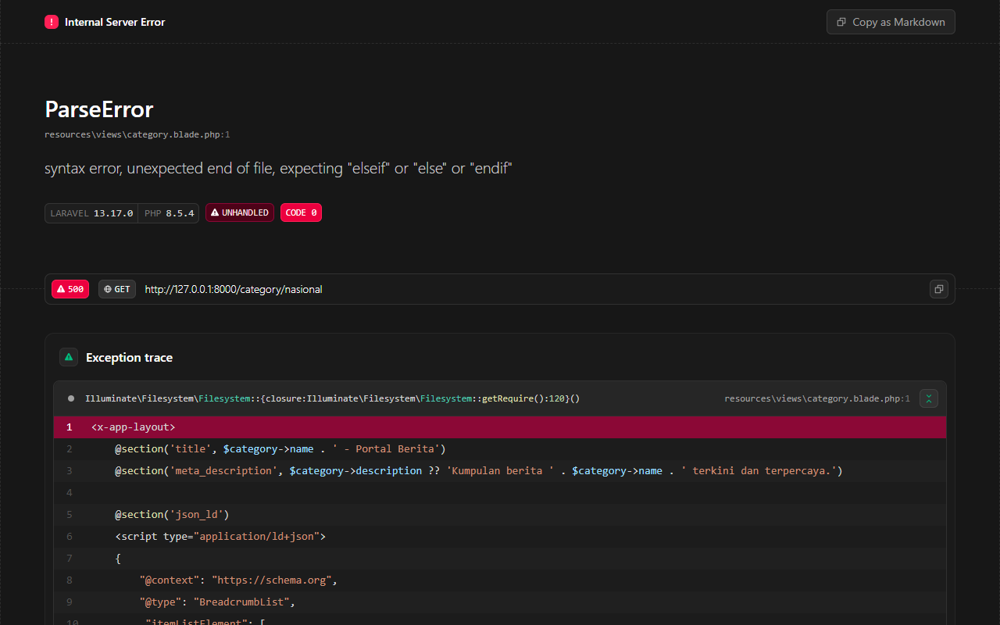
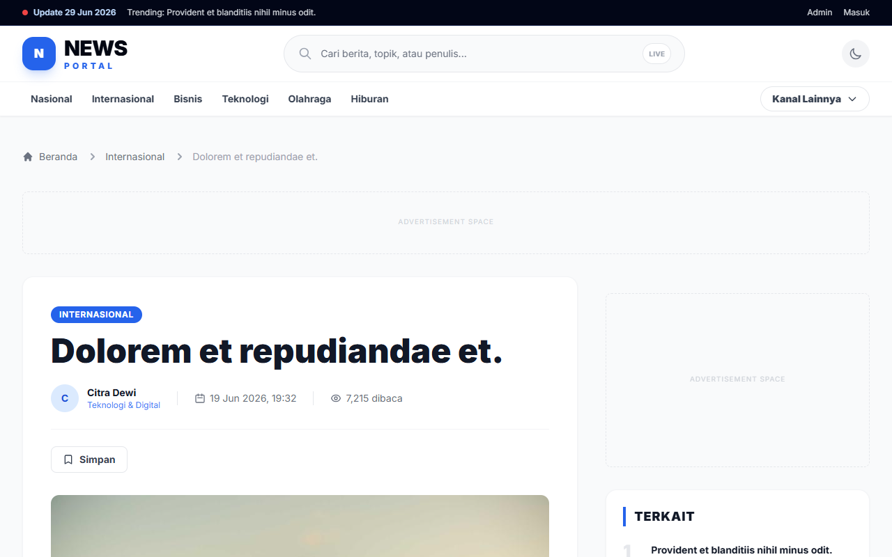
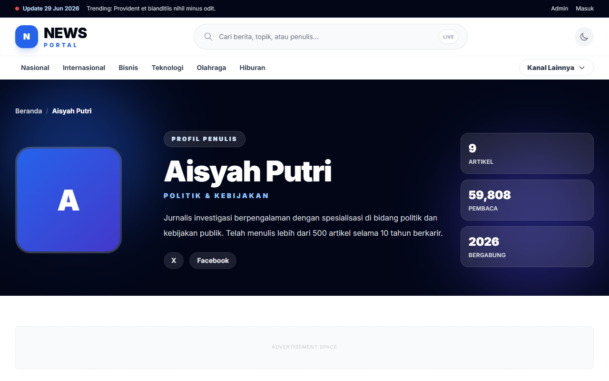
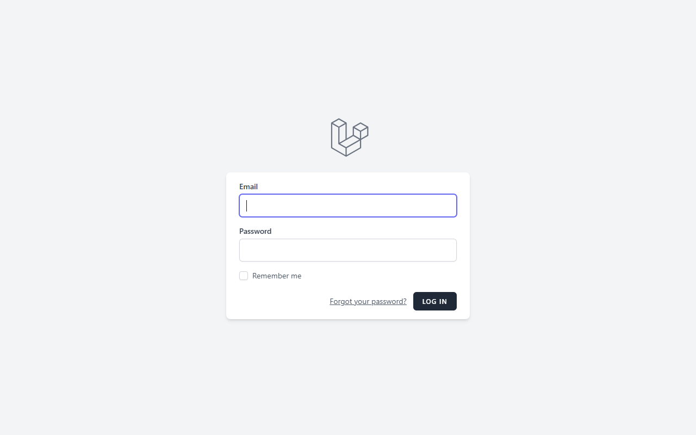
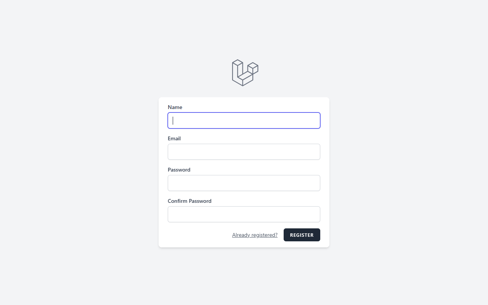
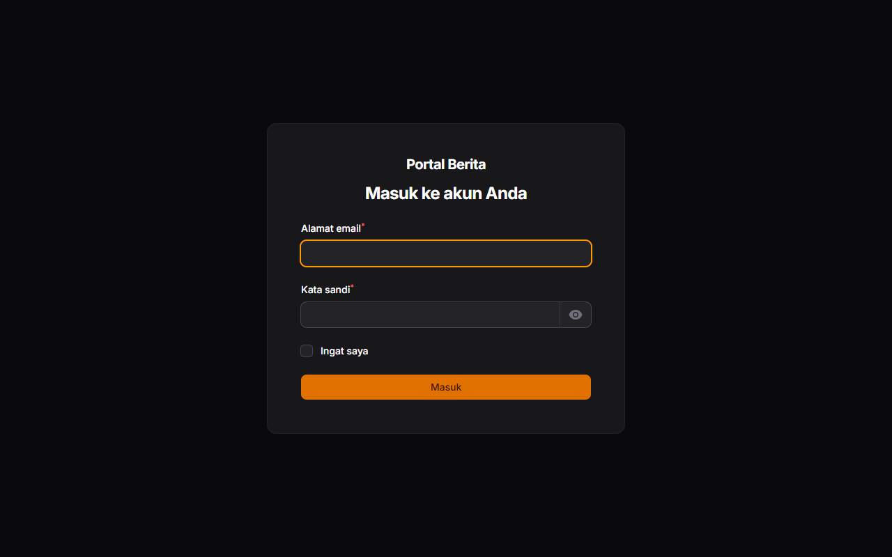
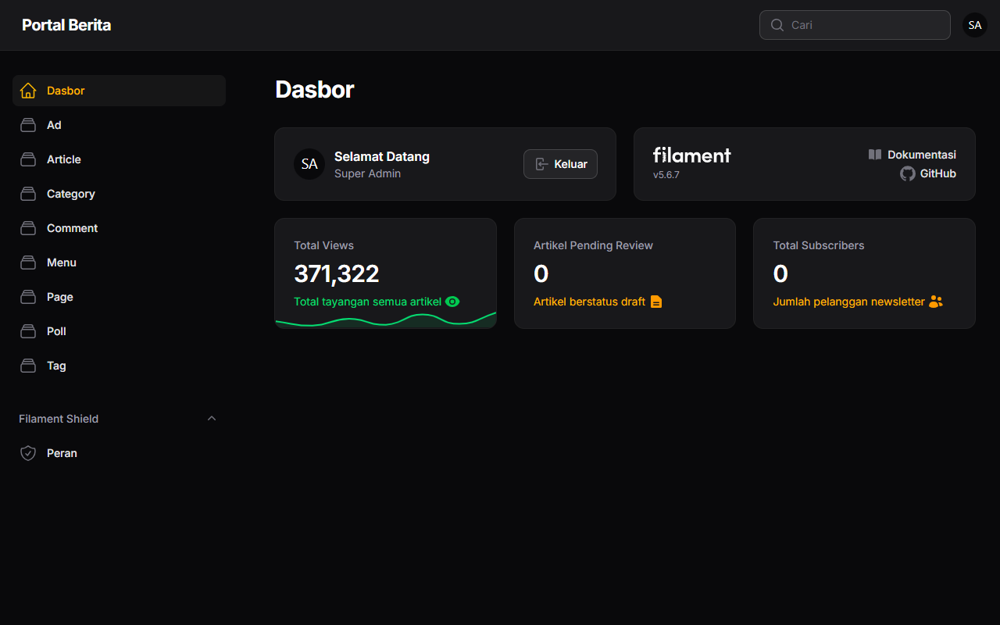

# Portal Berita Laravel (TALL Stack)

[](https://laravel.com)
[](https://vitejs.dev)
[](https://tailwindcss.com)
[](https://alpinejs.dev)
[](https://livewire.laravel.com)
[](LICENSE)

Portal Berita Modern berbasis web yang dibangun menggunakan **TALL Stack** (Tailwind CSS, Alpine.js, Laravel, Livewire). Aplikasi ini dirancang dengan arsitektur modern, performa tinggi, keamanan optimal, serta dioptimalkan untuk SEO (Search Engine Optimization) guna memberikan pengalaman membaca yang cepat dan interaktif.

---

## Fitur Utama

### 1. Content Management System (CMS) & Dynamic Home
*   **Filament Admin Dashboard (v3):** Manajemen artikel, kategori, tag, komentar, jajak pendapat (polling), dan menu navigasi secara dinamis.
*   **Role-Based Access Control (RBAC):** Pembagian peran pengguna menggunakan `spatie/laravel-permission` dengan peran utama `super_admin` dan `reporter`.
*   **Dynamic Landing Page:** Tata letak beranda yang dinamis menampilkan *Breaking News*, artikel unggulan (*Featured*), artikel terbaru (*Latest News*), serta blok berita berdasarkan kategori yang dapat dikontrol langsung dari admin panel.
*   **Custom Blade Components:** Desain modular dengan komponen UI premium untuk kartu artikel (`article-card`), seksi utama (`hero-section`), banner iklan (`ad-banner`), dan bilah sisi (`sidebar`).

### 2. Pencarian Real-Time (Livewire)
*   **Instant Search:** Fitur pencarian instan pada navigasi utama yang menampilkan hasil secara langsung tanpa memuat ulang halaman (*Single Page Application experience*).

### 3. Optimasi SEO & Social Sharing (Google News Ready)
*   **Dynamic Meta & Open Graph (OG):** Meta tags dinamis untuk Twitter Cards dan Facebook Open Graph pada setiap halaman artikel guna meningkatkan kualitas berbagi di media sosial.
*   **JSON-LD Structured Data:** Markup skema terstruktur otomatis untuk tipe data *NewsArticle*, *Organization*, dan *BreadcrumbList* guna kepatuhan penuh terhadap standar indeksasi Google News.
*   **Automated XML Sitemap:** Generator sitemap dinamis otomatis yang mencantumkan seluruh artikel aktif dan kategori di `/sitemap.xml`.
*   **Optimized Assets:** Gambar berbagi default (`default-share.png`) dan konfigurasi `robots.txt` yang optimal.

### 4. Performa Tinggi & Skalabilitas
*   **Redis Caching:** Caching otomatis pada widget dinamis dengan trafik tinggi (seperti *Hot Tags*, *Popular Articles*, *Category Navigation*, dan *Breaking News*) untuk mereduksi beban kueri database.
*   **Asynchronous View Tracking:** Pencatatan jumlah pembaca artikel menggunakan Laravel Queue/Jobs (`TrackArticleView`) yang diproses secara latar belakang (*background job*), mencegah terjadinya *database locking* saat lonjakan trafik.
*   **Spam & Bot Protection:** Mekanisme validasi IP dan User-Agent pada view tracker untuk mencegah spamming hitungan pembaca.

### 5. Fitur Interaktif & Pengguna
*   **Livewire Polling Widget:** Jajak pendapat interaktif di bilah sisi dengan kalkulasi suara real-time.
*   **User Dashboard & Bookmark:** Pengguna terdaftar dapat menyimpan/menandai artikel (*bookmark*) untuk dibaca kembali melalui dasbor pribadi mereka.
*   **Interactive Comments:** Kolom komentar pada setiap artikel untuk memfasilitasi diskusi pembaca.

---

## Tampilan & Preview Halaman

Berikut adalah preview visual dari halaman-halaman utama aplikasi Portal Berita:

### 1. Halaman Beranda (Home Page)
Menampilkan *Breaking News ticker*, artikel *Hero*, berita utama, dan pengelompokan berita per kategori secara dinamis.


### 2. Halaman Kategori (Category Page)
Menampilkan daftar artikel yang difilter berdasarkan kategori tertentu dengan tata letak grid yang rapi dan responsif.


### 3. Detail Artikel (Article Detail)
Halaman membaca berita yang dilengkapi dengan metadata penulis, tanggal rilis, isi artikel, hot tags, artikel terkait, serta kolom komentar di bagian bawah.


### 4. Halaman Profil Penulis (Author Profile)
Menampilkan biodata penulis/reporter, keahlian, media sosial, serta seluruh daftar artikel yang telah dipublikasikan oleh penulis tersebut.


### 5. Halaman Login & Register (Autentikasi Pengguna)
Halaman masuk dan pendaftaran akun pengguna dengan desain antarmuka yang bersih dan aman.
| Login Pengguna | Register Pengguna |
| :---: | :---: |
|  |  |

### 6. Admin Panel (Filament Dashboard)
Pusat kontrol administrasi untuk mengelola konten portal berita secara menyeluruh.
| Admin Login | Admin Dashboard |
| :---: | :---: |
|  |  |

---

## Spesifikasi Teknologi

*   **Backend:** PHP v8.2+ & Laravel Framework v11.x
*   **Frontend:** Blade Templates, Livewire v3, Alpine.js, Tailwind CSS v4 (melalui Vite)
*   **Database:** MySQL / MariaDB
*   **Caching & Queue:** Redis (Opsional, dapat menggunakan database/file driver sebagai fallback)
*   **Package Pendukung Utama:**
    *   `filament/filament` - Panel Admin
    *   `spatie/laravel-permission` - Manajemen Role & Permission
    *   `spatie/laravel-medialibrary` - Pengelolaan File Gambar Artikel

---

## Langkah Instalasi

Ikuti langkah-langkah di bawah ini untuk menjalankan project ini di lingkungan lokal Anda:

### 1. Prasyarat
Pastikan Anda telah menginstal komponen berikut di komputer Anda:
*   PHP >= 8.2
*   Composer
*   Node.js & NPM
*   MySQL atau MariaDB
*   Redis Server (opsional, untuk caching & antrean optimal)

### 2. Kloning Repositori
```bash
git clone https://github.com/MahesaPenemuanAli/news_laravel13.git
cd news_laravel13
```

### 3. Instalasi Dependensi PHP
```bash
composer install
```

### 4. Instalasi Dependensi Frontend
```bash
npm install
```

### 5. Konfigurasi Environment File
Salin file `.env.example` menjadi `.env` dan sesuaikan konfigurasi database serta Redis Anda:
```bash
cp .env.example .env
```
Buka file `.env` dan perbarui baris berikut sesuai dengan server lokal Anda:
```env
DB_CONNECTION=mysql
DB_HOST=127.0.0.1
DB_PORT=3306
DB_DATABASE=news_laravel13
DB_USERNAME=root
DB_PASSWORD=

QUEUE_CONNECTION=database # Ubah ke redis jika menggunakan Redis
CACHE_STORE=database      # Ubah ke redis jika menggunakan Redis
```

### 6. Generate Application Key
```bash
php artisan key:generate
```

### 7. Migrasi Database & Seeding Data
Jalankan migrasi untuk membuat tabel-tabel yang diperlukan dan masukkan data awal (seeding) untuk demonstrasi:
```bash
php artisan migrate --seed
```

### 8. Membuat Symbolic Link Storage
Guna menampilkan gambar artikel yang diunggah, buat tautan direktori penyimpanan:
```bash
php artisan storage:link
```

### 9. Menjalankan Queue Worker (Penting untuk View Tracker)
Karena pencatatan pembaca artikel diproses secara asinkron di latar belakang, jalankan worker berikut pada terminal terpisah:
```bash
php artisan queue:work
```

### 10. Menjalankan Aplikasi
Jalankan server lokal Laravel dan compiler aset Vite secara bersamaan:

*   **Menjalankan Server PHP:**
    ```bash
    php artisan serve
    ```
*   **Menjalankan Vite Dev Server:**
    ```bash
    npm run dev
    ```

Aplikasi kini dapat diakses melalui browser di alamat **[http://127.0.0.1:8000](http://127.0.0.1:8000)**.

---

## Kredensial Akses (Default Seed)

Setelah menjalankan seeder database, Anda dapat masuk menggunakan akun uji coba berikut:

### Akun Administrator (Filament Panel di `/admin`):
*   **Email:** `admin@news.com`
*   **Password:** `admin123`

### Akun Reporter / Penulis:
*   **Aisyah Putri:** `aisyah.putri@news.com` (Password: `password`)
*   **Budi Santoso:** `budi.santoso@news.com` (Password: `password`)
*   **Citra Dewi:** `citra.dewi@news.com` (Password: `password`)

---

## Skema Database Singkat

Berikut adalah hubungan antar-entitas utama dalam sistem ini:
*   `users` (Pembaca / Penulis / Admin)
*   `author_profiles` (Profil detail reporter, berelasi *one-to-one* dengan `users`)
*   `categories` (Kategori berita)
*   `articles` (Konten berita, berelasi *many-to-one* dengan `users` & `categories`)
*   `comments` (Komentar pembaca pada artikel)
*   `tags` (Kata kunci artikel, berelasi *many-to-many* via tabel pivot `article_tag`)
*   `polls` & `poll_options` (Pertanyaan dan pilihan suara jajak pendapat)
*   `menus` & `menu_items` (Navigasi header dan footer dinamis)

---

## Lisensi

Aplikasi ini didistribusikan di bawah lisensi **MIT**. Silakan gunakan dan kembangkan sesuai kebutuhan Anda.
